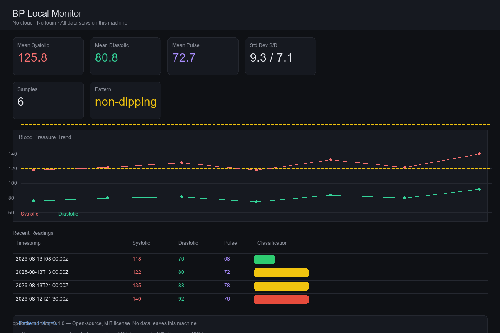

# BP Local Monitor

**Deterministic blood pressure monitoring. No cloud. No login. No external uploads.**


---

## Why I built this

A few years ago I started dealing with hypertension, chronic sinusitis, and a childhood asthma history. The doctor's plan was clear — medication, diet, and consistent monitoring — but the actual experience of logging readings was frustrating.

Most BP apps want an account, store your data on someone else's server, or bury you in subscriptions. I didn't want my health data syncing to a cloud I didn't control. I wanted something I could run locally, look at offline, and trust that the numbers weren't going anywhere.

So I built this as a personal tool. It's deterministic — same input, same output, no black-box AI classification. It generates a local HTML dashboard you can open in any browser. And because it's designed to be agent-native, terminal agents like Hermes, Claude Code, or OpenDevin can read its state, classify readings, and interact with it programmatically.

This isn't a medical device. It's a disciplined logging and analysis tool that helps me (and anyone else) stay informed about their own numbers.

---

## What it does

- **Logs BP readings** from any source (manual, Omron, etc.) into a local CSV
- **Classifies readings** using AHA/ESC-aligned thresholds — deterministic, no ML
- **Generates an HTML dashboard** with trend charts, statistics, and pattern insights
- **Pattern detection** flags non-dipping, nocturnal elevation, high variability, and frequent elevation
- **Agent-native interface** — any LLM terminal agent can query state, add readings, or read the prompt spec
- **Zero external dependencies** — `pydantic` and `rich` only; no API calls

---

## Screenshot

The dashboard is a single self-contained HTML file with no external JS/CSS:



> Self-contained HTML dashboard — no external JS/CSS, works offline.

---

## Agent-native design

Any terminal agent that can run shell commands and read/write files can interact with bp-local. The agent surface has three modes:

### 1. JSON state snapshot (`bp-local agent-context`)

Returns a deterministic JSON object containing the last 10 readings, trend summary, and an embedded prompt fragment the agent can use to understand the tool's constraints.

```json
{
  "tool": "bp-local-monitor",
  "version": "0.1.0",
  "sample_count": 3,
  "trend": { "mean_systolic": 125.0, "pattern": "stable" },
  "readings": [ ... ],
  "agent_prompt_fragment": "You are a blood pressure monitoring assistant...",
  "constraints": { "no_external_uploads": true, "local_only": true, "does_not_replace_physician": true }
}
```

### 2. JSONL event log (`bp-local agent-log`)

Appends all current readings to `bp_agent_log.jsonl` — line-delimited JSON, easy to stream, filter, and reason over.

### 3. Prompt spec (`bp-local agent-prompt`)

Prints the agent prompt fragment that defines classification rules, CLI commands, and behavioral constraints. Agents can load this into their system prompt to self-configure.

### Supported agents

| Agent | Integration |
|---|---|
| **Hermes** | Shell tool calls `bp-local agent-context` for state, `bp-local add` for logging |
| **Claude Code / OpenDevin** | Shell commands + JSONL event log reading |
| **Custom scripts** | `from bp_monitor import classify_bp, rolling_stats` |

See [docs/agent_usages.md](docs/agent_usages.md) for detailed workflows.

---

## Installation

```bash
# Clone
git clone https://github.com/<your-username>/bp-local-monitor.git
cd bp-local-monitor

# Install in editable mode
pip install -e ".[dev]"
```

---

## Usage

```bash
# Add a reading
bp-local add 2026-08-13T08:00:00Z 118 76 68 morning

# List recent readings
bp-local list

# Show windowed statistics
bp-local trend

# Generate HTML dashboard
bp-local dashboard

# Agent interfaces
bp-local agent-context   # JSON state for reasoning
bp-local agent-log       # Append to JSONL log
bp-local agent-prompt    # Print agent prompt fragment
```

---

## Classification thresholds

| Category | Systolic | Diastolic |
|---|---|---|
| Normal | < 120 | < 80 |
| Elevated | 120–129 | < 80 |
| Hypertension Stage 1 | 130–139 | 80–89 |
| Hypertension Stage 2 | ≥ 140 | ≥ 90 |
| Hypertensive crisis | > 180 | > 120 |

These are AHA/ESC-aligned for reference. This tool does not replace physician diagnosis.

---

## Clinical disclaimer

**This software is not a medical device.** It does not replace physician diagnosis, treatment, or emergency care. If you experience symptoms such as chest pain, severe headache, shortness of breath, or vision changes, seek medical attention immediately.

All data stays on your machine. No readings are uploaded, shared, or transmitted.

---

## Project structure

```
bp-local-monitor/
  src/bp_monitor/
    __init__.py        # Public API
    schemas.py         # Pydantic data contracts
    classifier.py      # Deterministic BP classification + pattern detection
    trends.py          # Rolling statistics and pattern analysis
    dashboard.py       # Self-contained HTML dashboard generator
    storage.py         # CSV read/write (no external deps)
    cli.py             # User-facing CLI
    agent.py           # Agent-native interface (JSONL, context, prompt spec)
  tests/
    test_bp_local_monitor.py  # 11 tests, deterministic thresholds + data contracts
  docs/
    agent_usages.md    # Agent integration workflows
```

---

## Why "deterministic"?

Most health apps use black-box models or cloud APIs. The classification here is pure threshold logic — identical input always produces identical output. You can audit every line. No training data, no model weights, no hidden state.

This matters when you're tracking something as sensitive as blood pressure. Determinism means trust.

---

## Contributing

Issues and PRs welcome. This project prioritizes:
- **Local-first**: no cloud features, no accounts
- **Determinism**: no randomness in classification
- **Transparency**: readable source, testable logic
- **Agent compatibility**: clean shell/JSON interfaces

---

## License

MIT — see [LICENSE](LICENSE).
